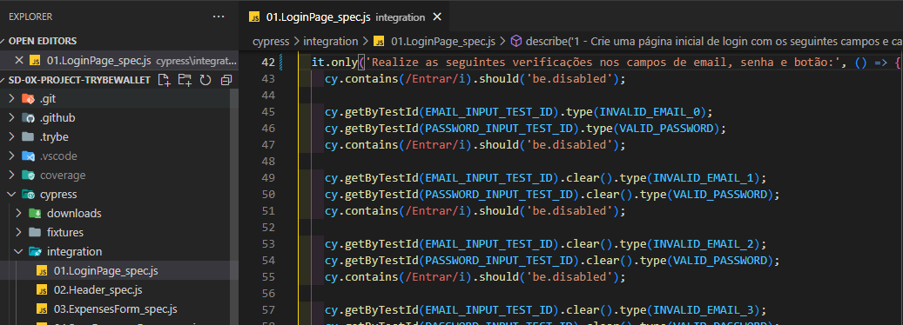

# Boas-vindas ao repositório do exercício bloggers!

Para realizar o exercício, atente-se a cada passo descrito a seguir e, se tiver qualquer dúvida, envie-a por _Slack_! 🚀

Aqui você vai encontrar os detalhes de como estruturar o desenvolvimento do seu exercício, utilizando uma _branch_ específica e um _pull request_ (PR) para colocar seus códigos.

# Entregáveis

<details>
  <summary><strong>🤷🏽‍♀️ Como entregar</strong></summary><br />

Para entregar o seu exercício você deverá criar um _Pull Request_ neste repositório.

Lembre-se que você pode consultar nosso conteúdo sobre [Git & GitHub](https://app.betrybe.com/course/4d67f5b4-34a6-489f-a205-b6c7dc50fc16/) e nosso [Blog - Git & GitHub](https://blog.betrybe.com/tecnologia/git-e-github/) sempre que precisar!

</details>

<details>
  <summary><strong>👨‍💻 O que deverá ser desenvolvido</strong></summary><br />
O desafio de hoje é implementar um _blog_ utilizando React Router. Neste exercício, você irá desenvolver uma aplicação com algumas rotas. Também será necessário passar informações dinamicamente entre as rotas através de parâmetros na URL.

</details>

<details>
  <summary><strong>:memo: Habilidades</strong></summary><br />

Neste exercício, verificamos se você é capaz de:

- Utilizar o React Router para criar rotas;
- Criar links de navegação na aplicação com os componentes Link e NavLink;
- Criar rotas, mapeando o caminho da URL com o componente correspondente, via Route;
- Criar rotas dinâmicas e utilizar o hook useParams para extrair parâmetros da URL.

</details>

# Orientações

<details>
  <summary><strong>‼️ Antes de começar a desenvolver</strong></summary><br />

1. Clone o repositório

- Use o comando: `git clone git@github.com:tryber/sd-034-exercise-bloggers`.
- Entre na pasta do repositório que você acabou de clonar:
  - `cd sd-034-exercise-bloggers`

2. Instale as dependências

- `npm install`.

3. Crie uma branch a partir da branch `main`

- Verifique que você está na branch `main`
  - Exemplo: `git branch`
- Se não estiver, mude para a branch `main`
  - Exemplo: `git checkout main`
- Agora crie uma branch à qual você vai submeter os `commits` do seu exercício
  - Você deve criar uma branch no seguinte formato: `nome-de-usuario-nome-do-exercicio`
  - Exemplo: `git checkout -b joaozinho-sd-034-exercise-bloggers`

4. Adicione as mudanças ao _stage_ do Git e faça um `commit`

- Verifique que as mudanças ainda não estão no _stage_
  - Exemplo: `git status` (deve aparecer listada a pasta _joaozinho_ em vermelho)
- Adicione o novo arquivo ao _stage_ do Git
  - Exemplo:
    - `git add .` (adicionando todas as mudanças - _que estavam em vermelho_ - ao stage do Git)
    - `git status` (deve aparecer listado o arquivo _joaozinho/README.md_ em verde)
- Faça o `commit` inicial
  - Exemplo:
    - `git commit -m 'iniciando o exercício x'` (fazendo o primeiro commit)
    - `git status` (deve aparecer uma mensagem tipo _nothing to commit_ )

5. Adicione a sua branch com o novo `commit` ao repositório remoto

- Usando o exemplo anterior: `git push -u origin joaozinho-sd-034-exercise-bloggers`

6. Crie um novo `Pull Request` _(PR)_

- Vá até a página de _Pull Requests_ do [repositório no GitHub](https://github.com/tryber/sd-034-exercise-bloggers/pulls)
- Clique no botão verde _"New pull request"_
- Clique na caixa de seleção _"Compare"_ e escolha a sua branch **com atenção**
- Coloque um título para a sua _Pull Request_
  - Exemplo: _"Cria tela de busca"_
- Clique no botão verde _"Create pull request"_
- Adicione uma descrição para o _Pull Request_ e clique no botão verde _"Create pull request"_
- **Não se preocupe em preencher mais nada por enquanto!**
- Volte até a [página de _Pull Requests_ do repositório](https://github.com/tryber/sd-034-exercise-bloggers/pulls) e confira que o seu _Pull Request_ está criado

</details>

<details>
  <summary><strong>⌨️ Durante o desenvolvimento</strong></summary><br />

- Faça `commits` das alterações que você fizer no código regularmente

- Lembre-se de sempre após um (ou alguns) `commits` atualizar o repositório remoto

- Os comandos que você utilizará com mais frequência são:
  1. `git status` _(para verificar o que está em vermelho - fora do stage - e o que está em verde - no stage)_
  2. `git add` _(para adicionar arquivos ao stage do Git)_
  3. `git commit` _(para criar um commit com os arquivos que estão no stage do Git)_
  4. `git push -u origin nome-da-branch` _(para enviar o commit para o repositório remoto na primeira vez que fizer o `push` de uma nova branch)_
  5. `git push` _(para enviar o commit para o repositório remoto após o passo anterior)_

</details>

<details>
  <summary><strong>🤝 Depois de terminar o desenvolvimento (opcional)</strong></summary><br />

Para sinalizar que o seu exercício está pronto para o _"Code Review"_, faça o seguinte:

- Vá até a página **DO SEU** _Pull Request_, adicione a label de _"code-review"_ e marque seus colegas:

  - No menu à direita, clique no _link_ **"Labels"** e escolha a _label_ **code-review**;

  - No menu à direita, clique no _link_ **"Assignees"** e escolha **o seu usuário**;

  - No menu à direita, clique no _link_ **"Reviewers"** e digite `students`, selecione o time `tryber/students-sd-034`.

Caso tenha alguma dúvida, [aqui tem um video explicativo](https://vimeo.com/362189205).

</details>

<details>
  <summary><strong>🕵🏿 Revisando um pull request</strong></summary><br />

Use o conteúdo sobre [Code Review](https://app.betrybe.com/course/real-life-engineer/code-review) para te ajudar a revisar os _Pull Requests_.

</details>

<details>
  <summary><strong>🎛 Linter</strong></summary><br />

Para garantir a qualidade do código, vamos utilizar neste exercício os linters `ESLint` e `StyleLint`.
Assim o código estará alinhado com as boas práticas de desenvolvimento, sendo mais legível
e de fácil manutenção! Para rodá-los localmente, execute os comandos abaixo:

```bash
  npm run lint
  npm run lint:styles
```

⚠️ **Pull requests com issues de Linter não serão avaliadas. Atente-se para resolvê-las antes de finalizar o desenvolvimento!** ⚠️

Em caso de dúvidas, confira o material do course sobre [ESLint e Stylelint](https://app.betrybe.com/course/real-life-engineer/eslint).

</details>

<details>
  <summary><strong>🛠 Testes</strong></summary><br />

- <details><summary><b>Execução de testes de requisito</b></summary>

  Os testes deste exercício foram feitos usando o [Cypress](https://www.cypress.io/how-it-works/). É utilizada nos testes a resolução `1366 x 768` (1366 pixels de largura por 768 pixels de altura) para testes de layout. Logo, recomenda-se desenvolver seu exercício usando a mesma resolução, via instalação [deste plugin](https://chrome.google.com/webstore/detail/window-resizer/kkelicaakdanhinjdeammmilcgefonfh?hl=en) do `Chrome`, de modo a facilitar a configuração dessa resolução, por exemplo.

  Para o exercício ser validado, todos os testes de comportamento devem passar. É possível testar isso localmente rodando `npm run cy`. Esse comando roda a suite de testes do Cypress, o qual valida se o fluxo geral e os requisitos funcionais estão como deveriam.

  > Você também pode executar o comando `npm run cy:open` para ter um resultado visual dos testes feitos.

  Aviso: Esses testes não consideram o layout de maneira geral, mas sim os atributos e informações corretas, por isso preste atenção! Os testes te darão uma mensagem de erro caso não estejam passando (seja qual for o motivo). 😉

  **Atenção:** Sua aplicação deve estar rodando no terminal com `npm start` para o Cypress poder testar.
  </details><br />

- <details><summary><b> Execução de um teste específico</b></summary>

  Para executar somente uma `spec` de testes, você pode ou rodar somente um arquivo de teste com o comando `npm run cy -- --spec cypress/e2e/01.FirstRoute.cy.js`, ou selecionar qual delas você deseja após executar o comando `npm run cy:open`.

  

  Além disso, ainda é possível rodar apenas um trecho de um `spec`, basta utilizar a função .only após o `describe`, `it` ou `test`. Com isso, será possível que apenas parte de um teste rode localmente e seja avaliado.

  

  </details><br />

</details>

<details>
  <summary><strong>🗣 Nos dê feedbacks sobre o exercício!</strong></summary> <br />

  Ao finalizar e submeter o exercício, não se esqueça de avaliar sua experiência preenchendo o formulário. Leva menos de 3 minutos!

  [FORMULÁRIO DE AVALIAÇÃO](https://be-trybe.typeform.com/to/ZTeR4IbH#cohort_hidden=CH34&template=betrybe/sd-0x-exercise-bloggers)

</details>

<details>
  <summary><strong>🗂 Compartilhe seu portfólio!</strong></summary><br />

Você sabia que o LinkedIn é a principal rede social profissional e compartilhar o seu aprendizado lá é muito importante para quem deseja construir uma carreira de sucesso? Compartilhe esse exercício no seu LinkedIn, marque o perfil da Trybe (@trybe) e mostre para a sua rede toda a sua evolução.

</details>

## Requisitos

> Dica: O arquivo `src/types.ts` possui algumas typagens prontas que podem ser úteis no decorrer do exercício!

## 1 - Crie as rotas para a aplicação

<details>
  <summary>Crie as primeiras rotas para a aplicação</summary><br />

- A rota `/` deve renderizar o componente `<Users />`
- A rota `/posts/:id` deve renderizar o componente `<Posts />`
- A rota `/about` deve renderizar o componente `<About />`
- Qualquer outra rota deve renderizar o componente `<NotFound />`

Todas páginas já estão criadas e podem ser encontrados na pasta `src/pages`.

</details>

<details>
  <summary><strong>O que será verificado</strong></summary><br />

- Se, ao entrar na rota `/` é renderizado apenas o componente `<Users />`;
- Se, ao entrar na rota `/posts/:id` é renderizado apenas o componente `<Posts />`.
- Se, ao entrar na rota `/about` é renderizado apenas o componente `<About />`.
- Se, ao entrar em uma rota inexistente é renderizado apenas o componente `<NotFound />`.

</details><br>

## 2 - Crie dois `NavLink` dentro do componente `Header`

<details>
  <summary>Crie dois <code>NavLink</code> para as rotas de <code>Home</code> e <code>About</code> </summary><br />

  O componente `Header` já está criado e pode ser encontrado na pasta `src/components`.

  - O primeiro deverá conter o texto `Home` e redirecionar para a rota `/`;
  - O segundo deverá conter o texto `About` e redirecionar para a rota `/about`.

</details>

<details>
  <summary><strong>O que será verificado</strong></summary><br />

- Se o componente `<Header />` possui dois links, um para a rota `/` e outro para a rota `/about`.

</details><br>

## 3 - Crie um link para a página de posts de um usuário

<details>
  <summary>Dentro do componente <code>User</code>, crie um link para a página de posts de um usuário</summary><br />

- O link deve conter o texto `Posts`;
- O link deve redirecionar para a rota `/posts/:id`, onde `:id` é o id do usuário.

</details>

<details>
  <summary><strong>O que será verificado</strong></summary><br />

- Se dentro do componente `<User />` existe um link para a página de posts de um usuário.

</details><br>

## 4 - Exiba os posts de um usuário

<details>
  <summary>Exiba os posts de apenas um usuário na página de posts</summary><br />

  Utilize o array de posts que está importado no componente `<Posts />` para exibir os posts de um usuário.
  Os posts seguem está mesma estrutura:

  ```js
  [
    {
      id: 10,
      title: 'They rushed out the door.',
      body: "They rushed out the door, grabbing anything and everything they could think of they might need. There was no time to double-check to make sure they weren't leaving something important behind. Everything was thrown into the car and they sped off. Thirty minutes later they were safe and that was when it dawned on them that they had forgotten the most important thing of all.",
      userId: 1,
    },
  // ...
  ]
  ```

  Você deve filtrar os posts de acordo com o `id` do usuário que está na rota e a chave `userId` dos posts.

  <details>
    <summary><strong>De olho na dica 👀</strong></summary><br />

  - Lembra que a rota `/posts/:id` é uma rota dinâmica? Portanto podemos acessar o valor de `:id` utilizando um certo hook 👀.

  </details>

</details>

<details>
  <summary><strong>O que será verificado</strong></summary><br />

- Se apenas os posts de um usuário são exibidos na página de posts.

</details><br>
