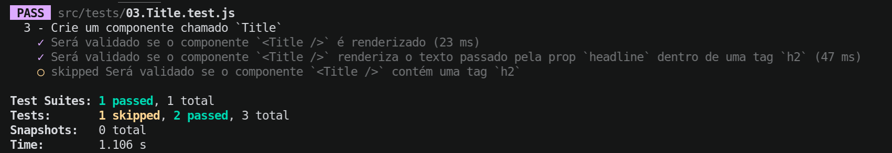

# Boas-vindas ao repositório do exercício Nobel Prizes!

Para realizar o exercício, atente-se a cada passo descrito a seguir e, se tiver qualquer dúvida, envie-a por _Slack_! 🚀

Aqui você vai encontrar os detalhes de como estruturar o desenvolvimento do seu exercício, utilizando uma _branch_ específica e um _pull request_ (PR) para colocar seus códigos.

# Termos e acordos

Ao iniciar este exercício, você concorda com as diretrizes do Código de Conduta e do Manual da Pessoa Estudante da Trybe.

# Entregáveis

<details>
  <summary><strong>🤷🏽‍♀️ Como entregar</strong></summary><br />

Para entregar o seu exercício você deverá criar um _pull request_ neste repositório.

> **Relembrando 🧠**: Lembre-se que você pode consultar nosso conteúdo sobre [Git & GitHub](https://app.betrybe.com/course/4d67f5b4-34a6-489f-a205-b6c7dc50fc16/) e nosso [Blog - Git & GitHub](https://blog.betrybe.com/tecnologia/git-e-github/) sempre que precisar!

</details>

<details>
  <summary><strong>👨‍💻 O que deverá ser desenvolvido</strong></summary><br />

Neste exercício, utilizando React com classes, você irá implementar uma aplicação que irá exibir uma lista de prêmios Nobel. Para isso, você irá consumir uma API que contém os dados dos prêmios Nobel.

</details>

<details>
  <summary><strong>:memo: Habilidades</strong></summary><br />

Neste exercício, verificamos se você é capaz de:

- Criar componentes React reutilizáveis com classes;

- Realizar requisições a uma API com ciclos de vida de componentes;

- Renderizar as informações contidas em um _array_ em forma de componente;

</details>

# Orientações

<details>
  <summary><strong>‼️ Antes de começar a desenvolver</strong></summary><br />

1. Clone o repositório

- Use o comando: `git clone git@github.com:tryber/sd-034-exercise-nobel-prizes`.
- Entre na pasta do repositório que você acabou de clonar:
  - `cd sd-034-exercise-nobel-prizes`

2. Instale as dependências

- `npm install`.

3. Crie uma branch a partir da branch `main`

- Verifique que você está na branch `main`
  - Exemplo: `git branch`
- Se não estiver, mude para a branch `main`
  - Exemplo: `git checkout main`
- Agora crie uma branch à qual você vai submeter os `commits` do seu exercício
  - Você deve criar uma branch no seguinte formato: `nome-de-usuario-nome-do-exercicio`
  - Exemplo: `git checkout -b joaozinho-sd-034-exercise-nobel-prizes`

4. Adicione as mudanças ao _stage_ do Git e faça um `commit`

- Verifique que as mudanças ainda não estão no _stage_
  - Exemplo: `git status` (deve aparecer listada a pasta _joaozinho_ em vermelho)
- Adicione o novo arquivo ao _stage_ do Git
  - Exemplo:
    - `git add .` (adicionando todas as mudanças - _que estavam em vermelho_ - ao stage do Git)
    - `git status` (deve aparecer listado o arquivo _joaozinho/README.md_ em verde)
- Faça o `commit` inicial
  - Exemplo:
    - `git commit -m 'iniciando o exercício x'` (fazendo o primeiro commit)
    - `git status` (deve aparecer uma mensagem tipo _nothing to commit_ )

5. Adicione a sua branch com o novo `commit` ao repositório remoto

- Usando o exemplo anterior: `git push -u origin joaozinho-sd-034-exercise-nobel-prizes`

6. Crie um novo `Pull Request` _(PR)_

- Vá até a página de _Pull Requests_ do [repositório no GitHub](https://github.com/tryber/sd-034-exercise-nobel-prizes/pulls)
- Clique no botão verde _"New pull request"_
- Clique na caixa de seleção _"Compare"_ e escolha a sua branch **com atenção**
- Coloque um título para a sua _Pull Request_
  - Exemplo: _"Cria tela de busca"_
- Clique no botão verde _"Create pull request"_
- Adicione uma descrição para o _Pull Request_ e clique no botão verde _"Create pull request"_
- **Não se preocupe em preencher mais nada por enquanto!**
- Volte até a [página de _Pull Requests_ do repositório](https://github.com/tryber/sd-034-exercise-nobel-prizes/pulls) e confira que o seu _Pull Request_ está criado

</details>

<details>
  <summary><strong>⌨️ Durante o desenvolvimento</strong></summary><br />

- Faça `commits` das alterações que você fizer no código regularmente

- Lembre-se de sempre após um (ou alguns) `commits` atualizar o repositório remoto

- Os comandos que você utilizará com mais frequência são:
  1. `git status` _(para verificar o que está em vermelho - fora do stage - e o que está em verde - no stage)_
  2. `git add` _(para adicionar arquivos ao stage do Git)_
  3. `git commit` _(para criar um commit com os arquivos que estão no stage do Git)_
  4. `git push -u origin nome-da-branch` _(para enviar o commit para o repositório remoto na primeira vez que fizer o `push` de uma nova branch)_
  5. `git push` _(para enviar o commit para o repositório remoto após o passo anterior)_

</details>

<details>
  <summary><strong>🤝 Depois de terminar o desenvolvimento (opcional)</strong></summary><br />

Para sinalizar que o seu exercício está pronto para o _"Code Review"_, faça o seguinte:

- Vá até a página **DO SEU** _Pull Request_, adicione a label de _"code-review"_ e marque seus colegas:

  - No menu à direita, clique no _link_ **"Labels"** e escolha a _label_ **code-review**;

  - No menu à direita, clique no _link_ **"Assignees"** e escolha **o seu usuário**;

  - No menu à direita, clique no _link_ **"Reviewers"** e digite `students`, selecione o time `tryber/students-sd-034`.

Caso tenha alguma dúvida, [aqui tem um video explicativo](https://vimeo.com/362189205).

</details>

<details>
  <summary><strong>🕵🏿 Revisando um pull request</strong></summary><br />

Use o conteúdo sobre [Code Review](https://app.betrybe.com/course/real-life-engineer/code-review) para te ajudar a revisar os _Pull Requests_.

</details>

<details>
  <summary><strong>🎛 Linter</strong></summary><br />

Para garantir a qualidade do código, vamos utilizar neste exercício os linters `ESLint` e `StyleLint`.
Assim o código estará alinhado com as boas práticas de desenvolvimento, sendo mais legível
e de fácil manutenção! Para rodá-los localmente, execute os comandos abaixo:

```bash
  npm run lint
  npm run lint:styles
```

⚠️ **PULL REQUESTS COM ISSUES DE LINTER NÃO SERÃO AVALIADAS.
ATENTE-SE PARA RESOLVÊ-LAS ANTES DE FINALIZAR O DESENVOLVIMENTO!** ⚠️

Em caso de dúvidas, confira o material do course sobre [ESLint e Stylelint](https://app.betrybe.com/course/real-life-engineer/eslint).

</details>

<details>
  <summary><strong>🛠 Testes</strong></summary><br />

Para avaliar o exercício, iremos utilizar [React Testing Library (RTL)](https://testing-library.com/docs/react-testing-library/intro) na execução dos testes.

Na descrição dos requisitos,logo abaixo, será solicitado que seja feita a adição de atributos data-testid nos elementos *HTML*.
  
Vamos a um exemplo de modo a deixar evidente essa configuração: se o requisito pedir "crie um botão e adicione o id de teste (ou data-testid) com o valor my-action, você pode escrever:

```html
<button data-testid="my-action"></button>
```

ou

```html
<a data-testid="my-action"></a>
```

Ou seja, o atributo `data-testid="my-action"` servirá para o React Testing Library(RTL) identificar o elemento, dessa forma conseguiremos realizar testes focados no comportamento da aplicação.

⚠️**AVISO**: Muito cuidado com os nomes especificados nos requisitos! O conteúdo deve ser **exatamente igual** ao texto descrito no requisito.

Para verificar a solução proposta, você pode efetuar todos os testes localmente, basta executar:

```bash
npm test
```

### Dica: desativando testes

Especialmente no início, quando a maioria dos testes está falhando, a saída após executar os testes é extensa. Você pode desabilitar temporariamente um teste utilizando a função `skip` junto à função `it`. Como o nome indica, esta função "pula" um teste. Veja um exemplo:

```js
it.skip("Será validado se o campo de filtro por nome renderiza na tela", () => {
  render(<App />);
  const filterNameInput = screen.getByTestId(/name-filter/i);
  expect(filterNameInput).toBeInTheDocument();
});
```



> Uma estratégia é pular todos os testes no início e ir implementando um teste de cada vez, removendo dele a função `skip`.

Como uma segunda proposta, você também pode rodar apenas um arquivo de teste, por exemplo:

```bash
npm test 
```

Outra forma para contornar esse problema é a utilização da função `.only` após o `it`. Com isso, será possível que apenas um requisito rode localmente e seja avaliado.

```js
it.only("Será validado se o campo de filtro por nome renderiza na tela", () => {
  render(<App />);
  const filterNameInput = screen.getByTestId(/name-filter/i);
  expect(filterNameInput).toBeInTheDocument();
});
```


⚠️ Atenção: **O avaliador automático não necessariamente avalia seu exercício na ordem em que os requisitos aparecem no readme. Isso acontece para deixar o processo de avaliação mais rápido. Então, não se assuste se isso acontecer, ok?**

</details>

<details>
  <summary><strong>🗣 Nos dê feedbacks sobre o exercício!</strong></summary> <br />

  Ao finalizar e submeter o exercício, não se esqueça de avaliar sua experiência preenchendo o formulário. Leva menos de 3 minutos!

  [FORMULÁRIO DE AVALIAÇÃO](https://be-trybe.typeform.com/to/ZTeR4IbH#cohort_hidden=CH34&template=betrybe/sd-0x-exercise-nobel-prizes)

</details>

<details>
  <summary><strong>🗂 Compartilhe seu portfólio!</strong></summary><br />

Você sabia que o LinkedIn é a principal rede social profissional e compartilhar o seu aprendizado lá é muito importante para quem deseja construir uma carreira de sucesso? Compartilhe esse exercício no seu LinkedIn, marque o perfil da Trybe (@trybe) e mostre para a sua rede toda a sua evolução.

</details>

# Requisitos

## 1. Implemente o componente `Header`

<details>
  <summary>Este componente deverá renderizar o logo da página:</summary>
  
  - O componente deve ser um componente de classe;

  - Exiba o logo do prêmio nobel, que está disponível no arquivo `src/assets/nobel_logo.png` dentro de uma tag `<header />`.
    - A imagem deve possuir a propriedade `alt` com o valor `Nobel Logo`;

  - Renderize o componente `Header` no componente `App`.
  
</details>

<details>
  <summary><strong>O que será verificado</strong></summary>

- Será verificado se o componente `Header` é renderizado no componente `App`;
- Será verificado se o componente `Header` é um componente de classe;
- Será verificado se o componente `Header` renderiza o logo do prêmio nobel;

</details>

## 2. Implemente o componente `NobelPrize`

<details>
  <summary>Renderize uma lista com as informações das premiações do Nobel</summary>

  - As informações devem ser obtidas através da API do prêmio nobel, disponível em `https://api.nobelprize.org/2.1/nobelPrizes`;

  - <details><summary>Exemplo de retorno da API</summary><br />
    
    ```json
    {
      "nobelPrizes": [
        {
          "awardYear": "1901",
          "category": {
            "en": "Chemistry",
            "no": "Kjemi",
            "se": "Kemi"
          },
          "categoryFullName": {
            "en": "The Nobel Prize in Chemistry",
            "no": "Nobelprisen i kjemi",
            "se": "Nobelpriset i kemi"
          },
          "dateAwarded": "1901-11-12",
          "prizeAmount": 150782,
          "prizeAmountAdjusted": 8722510,
          "links": [
            {
              "rel": "nobelPrize",
              "href": "https://api.nobelprize.org/2/nobelPrize/che/1901",
              "action": "GET",
              "types": "application/json"
            }
          ],
          "laureates": [
            {
              "id": "160",
              "knownName": {
                "en": "Jacobus H. van 't Hoff"
              },
              "fullName": {
                "en": "Jacobus Henricus van 't Hoff"
              },
              "portion": "1",
              "sortOrder": "1",
              "motivation": {
                "en": "in recognition of the extraordinary services he has rendered by the discovery of the laws of chemical dynamics and osmotic pressure in solutions",
                "se": "såsom ett erkännande av den utomordentliga förtjänst han inlagt genom upptäckten av lagarna för den kemiska dynamiken och för det osmotiska trycket i lösningar"
              },
              "links": [
                {
                  "rel": "laureate",
                  "href": "https://api.nobelprize.org/2/laureate/160",
                  "action": "GET",
                  "types": "application/json"
                }
              ]
            }
          ]
        },
        {/* ... */},
        {/* ... */}
      ]
    }
    ```
    </details>

  Dentro do app exiba todos os prêmios retornados da API, de forma que o componente `NobelPrize` deverá ser renderizado para cada prêmio.

  - O componente `NobelPrize` deve ser um componente de classe;
    - Exiba a categoria do prêmio dentro de uma tag `h2`;

    > Dica: a categoria do prêmio está disponível na chave `categoryFullName` do objeto de cada prêmio e deve ser renderizada em inglês (`en`).

    - Exiba a data do prêmio dentro de uma tag `h4`;
    > Dica: deve ser renderizada a data completa e não apenas o ano.

</details>

<details>
  <summary><strong>O que será verificado</strong></summary>

  - Será verificado se o componente `NobelPrize` renderiza a categoria dos prêmios dentro de uma tag `h2`;
  - Será verificado se o componente `NobelPrize` renderiza a data dos prêmios dentro de uma tag `h4`;

</details>

## 3. Implemente o componente `Laureate`

<details>
  <summary>Renderize uma lista com as informações dos ganhadores do Nobel</summary>

  - Dentro do componente `NobelPrize`, renderize uma lista com os ganhadores do prêmio;
  - Para cada ganhador, renderize o componente `Laureate`;
  - O componente deve ser um componente de classe;
  - Exiba o nome do ganhador dentro de uma tag `h3`;

  > Dica: o nome do ganhador está disponível na chave `knownName` do objeto de cada ganhador e deve ser renderizado em inglês (`en`).
  
  > Algumas premiações não possuem esse campo, nesse caso, renderize o nome completo (`orgName`).

  - Exiba o motivo do prêmio dentro de uma tag `p`;

</details>

<details>
  <summary><strong>O que será verificado</strong></summary>

  - Será verificado se o componente `Laureate` renderiza o nome do ganhador dentro de uma tag `h3`;
  - Será verificado se o componente `Laureate` renderiza o motivo do prêmio dentro de uma tag `p`;

</details>
